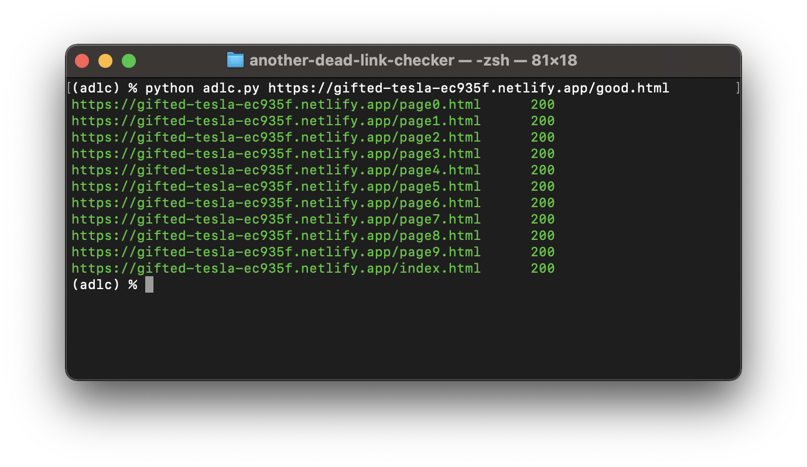

# another-dead-link-checker

This will parse a web page and validate all href references on the page.

## Using it

### Create and activate a virtual environment
```
python3 -m venv adlc
source adlc/bin/activate
```

### Loading requirements
```
cd another-dead-link-checker
pip install -r requirements.txt
```

### Running another-dead-link-checker
```
python adlc.py <url>
```

## Sample output

```
(adlc) % python adlc.py https://gifted-tesla-ec935f.netlify.app/
https://gifted-tesla-ec935f.netlify.app/random.html	200
https://gifted-tesla-ec935f.netlify.app/bad.html	200
https://gifted-tesla-ec935f.netlify.app/good.html	200
```




